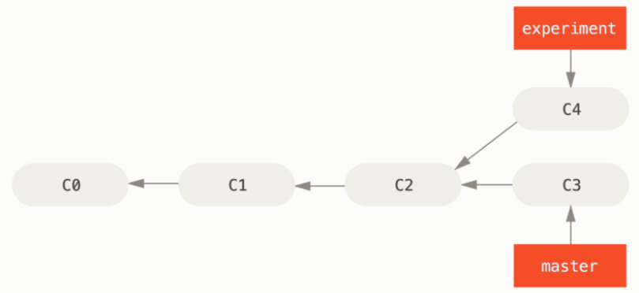
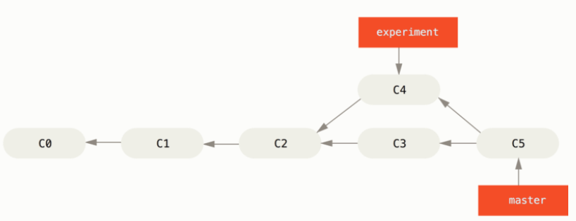

# Introduction  

The best information sources on `Git` usage are
> - https://www.atlassian.com/git/tutorials
> - https://git-scm.com/book/en/v2
> - https://www.atlassian.com/git/tutorials/atlassian-git-cheatsheet

# Work with local repo
Create new local repo
``` 
git init <project_dir>
```
Get local copy (working copy) of the existing remote repo 
```
git clone <repo_url>
```
Review changes made and prepare (stage) changes for commit
```
git status
git add .
```
Commit staged changes
```
git commit -m "comment"
```


# Work with remote
```bash
# Add remote repo to your local created repo and set upstream branches
git remote add <remote_name> <remote_repo_url>
# Push local branch to correspondent remote branch
git push -u <remote_name> <local_branch_name>
```

# Collaborating example for our knowledge base (KB)
Say you have a task to add info about definite reactor project to a KB. Typical way you can follow is:
- Create directory for information, say "WWER"
- Create correspondent branch in your local repo. Each reactor you're working on could be accounted like a _feature_, so you can logically isolate work in dedicated branch
```bash
# ! make shure you're on your master branch before
git checkout -b WWER
```
this will create a branch name `WWER` based on your current master branch.
- Fill the dir with the following
  - `pic/` subfolder for pictures
  - `ref/` subfolder for reference files (say .pdf, .djvu or any)
  - `template.md` file and rename it the same as directory name -> `WWER.md`
- Work on the content. Files (say .pdfs) that you found at web you can place in `ref/` subfolder. This materials you must upload to the NNSTU_docs/src/SMR/KnowledgeBase/ subfolder at our Google drive. For example case it will be `NNSTU_docs/src/SMR/KnowledgeBase/WWER`. Subfolder `ref/` MUST be excluded from version control (git mustn't track it) by adding it to .gitignore file at the root knowledbase folder. So in this example
```bash
# knowledge_base/.gitignore must include following string
  WWER/ref
```
This must be done because Git masterly developed for version-control of a **text** files and not  of **binaries**, so their direct presence in repo will pollute and overload storage
- Referencing literature in the text of `WWER.md` must be done by copying references to correspondent files from our Google drive, say ...
```bash
# in WWER.md it will be
[SomeArticle](https://drive.google.com/drive/folders/19dNsOWK52JW8qCkX-kevAO5OWJ721Ver?usp=share_link)
# or you can just make a web reference for the resource
```
... and it will look like: [SomeArticle](https://drive.google.com/drive/folders/19dNsOWK52JW8qCkX-kevAO5OWJ721Ver?usp=share_link) reference.
- Once you finished some vital portion of work you can commit it locally (save the state of KB to a repo):
```bash
# ! Don't forget to check .gitignore before
git add .
git commit -m "some useful info added"
``` 
this will commit your changes to your local WWER branch. Try to make commit message useful.
- Say, once in a day (or more often) you can upload your significant changes to remote repo to make your work safe from missing. This can be done by
```bash
# ! Make shure you have no pendidng changes by running  git status
git checkout WWER
git push origin 
# Alternatively if you're not checked out on the WWER branch (say you're now on master) you can point to the branch you want to upload
git push origin WWER
```
this will push your `WWER` branch to a correspondent remote branch `origin/WWER`
- When you're done with work on a reactor completely (before the meeting) your branch could be merged into master branch. This is two step process: merge branch into master locally and then push (upload) your updated master to the upstream (remote) master, so
```bash
# checkout to the local master
git checkout master
# merge WWER branch into your master branch
git merge WWER
# push updated master to upstream
git push origin
```
- there may be a situation when `origin/master` branch was updated earlier than you finished work with your branch. Say Yudi has finished his work and merged in to remote earlier or Alex just added some info into `origin/master` directly. In this situation you'll be rejected by git from pushing your master to remote because the `remote/master` is now ahead of your local `master`. In this case you first need to download `remote/master` to get your local version of it up to date. This could be done in two ways:  
  1) fetch `origin/master` from remote and then merge it with your `master` 
  2) use `git pull` command that is a combination of the former two
```bash
# checkout to local master
git checkout master

# --- the first way
# fetch master from remote - it will create read-only local pointer origin/master
git fetch origin master
# merge actual remote master to local
git merge origin/master

# --- the second way
# fetch and merge via single pull command
git pull origin master
```
then you are ready to push master to the upstream via `git push`  
There is another way to integrate your branch with another - [rebasing](https://git-scm.com/book/en/v2/Git-Branching-Rebasing).  
Say you get the following commit history:  
and you want to incorporate chenges in your `experiment` branch into `master`. With merging you'd go as
```bash
git checkout master
git merge experiment
``` 
to merge the `experiment` into `master` getting additional _merge_-commit and loop-like history as 
With `rebasing` this is another idea: you can take the patch of the change that was introduced in C4 and reapply it on top of C3. In Git, exactly this is called `rebasing`. With the `rebase` command, you can take all the changes that were committed on one branch and replay them on a different branch. For this example, you would check out the experiment branch, and then rebase it onto the master branch as follows:
```bash
git checkout experiment
git rebase master
```
resulting in pretty linear history of changes

Having this you can go back to the master branch and do a fast-forward merge:
```bash
git checkout master
git merge experiment
```
Finally after `fast-forward` you'll get the desired contribution result

***
For advanced info on collaborating using git branching workflow with extended examples visit 
- https://git-scm.com/book/en/v2/Git-Branching-Remote-Branches
- https://git-scm.com/book/en/v2/Distributed-Git-Contributing-to-a-Project
- https://git-scm.com/book/en/v2/Git-Branching-Rebasing 